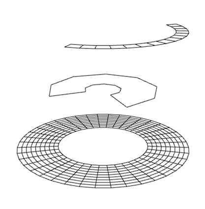

# geo-arc


[](http://github.com/badges/stability-badges)

Creates a 2d arc in 3d space.

## Usage

[](https://www.npmjs.com/package/geo-arc)

### Example

An example can be found at `./test/index.js`. You can run this test by calling:
```
$ npm test
```

A simple usage example with default values being passed as settings:
```javascript
var geoArc = require('geo-arc');

// geo will be a Object will three properties:
// positions - the vertices
// cells - the indices to draw the arc
// uvs - uv values for for the arc
var geo = geoArc( {
    cellSize: 3, // 1 == points, 2 == lines, 3 == triangles
    x: 0, // x position of the center of the arc
    y: 0, // y position of the center of the arc
    z: 0, // z position of the center of the arc
    startRadian: 0, // start radian for the arc
    endRadian: 1.5, // end radian for the arc
    innerRadius: 40, // inner radius of the arc
    outerRadius: 200, // outside radius of the arc
    numBands: 2, // subdivision from inside out 
    numSlices: 40, // subdivision along curve
    drawOutline: true // if cellSize == 2 draw only the outside of the shape
});
```

Generated uv values look like this:


## License

MIT, see [LICENSE.md](http://github.com/mikkoh/geoArc/blob/master/LICENSE.md) for details.
